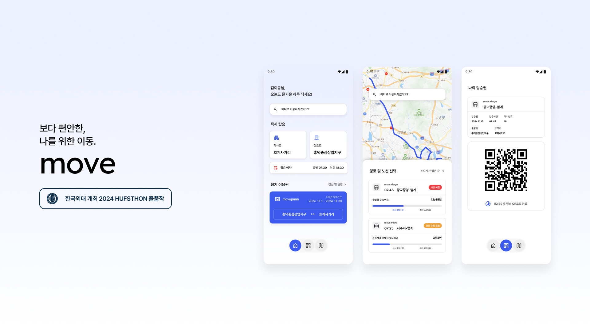

# Move

Team Unicon의 프로젝트 **Move**는 경기도의 통근 문제를 해결하기 위한 솔루션을 제공합니다. 우리의 목표는 통근 과정에서의 불편함을 줄이고, 보다 친환경적이며 개인화된 교통 경험을 제공하는
것입니다.

## 문제 정의

1. **버스 승차의 불확실성**: 배차 간격 및 입석 금지로 인해 원하는 시간에 버스를 타지 못하는 상황 발생.
2. **노선의 부재**: 적은 수요로 인해 주요 노선이 없거나 불편한 경로로 인해 출퇴근 시간이 낭비됨.
3. **교통 피로 증가**: 출퇴근 시간이 길어짐에 따라 운전자와 탑승자 모두 교통 피로에 시달림.

## 비즈니스 솔루션

- 수요 기반으로 유연한 노선을 제공하는 맞춤형 소형 버스 서비스.
- 기존 45인승 대형 버스 대신 소형 차량을 활용하여 개개인의 편의성 강화.
- 특정 노선에 수요가 적더라도 일부 수요를 충족할 수 있도록 경로 최적화.

## 서비스 장점

- **경로 최적화**: 최적화된 노선으로 이동 시간 단축.
- **환경 친화적 접근**: 친환경 차량 활용 및 교통 혼잡 감소.
- **확실성 제공**: 예약을 통한 안정적인 승차 보장.
- **커뮤니티 기반**: 사용자 간의 커뮤니티 구축 및 피드백 반영.

## 기회 및 성장 가능성

- 맞춤형 서비스에 대한 수요 증가.
- 스마트 기술 도입을 통한 운영 효율성 향상.
- 환경 및 교통 정책 지원으로 사업 확장 가능.
- 재택근무 혼합 시대에 적합한 유연한 서비스 제공.

  
### Contributors 👩‍💻👨‍💻

